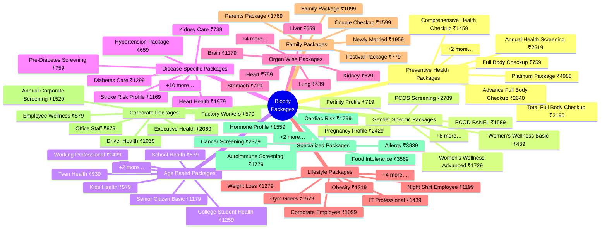
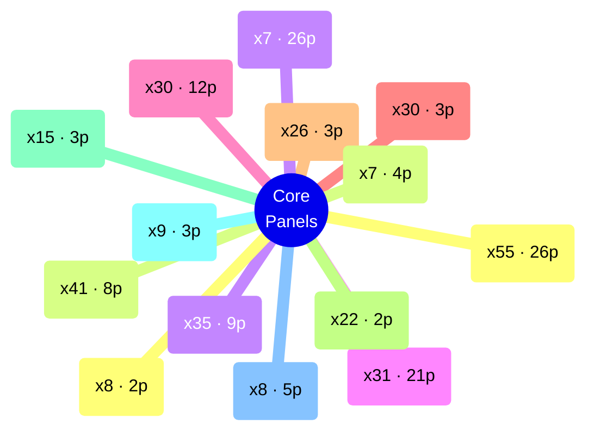
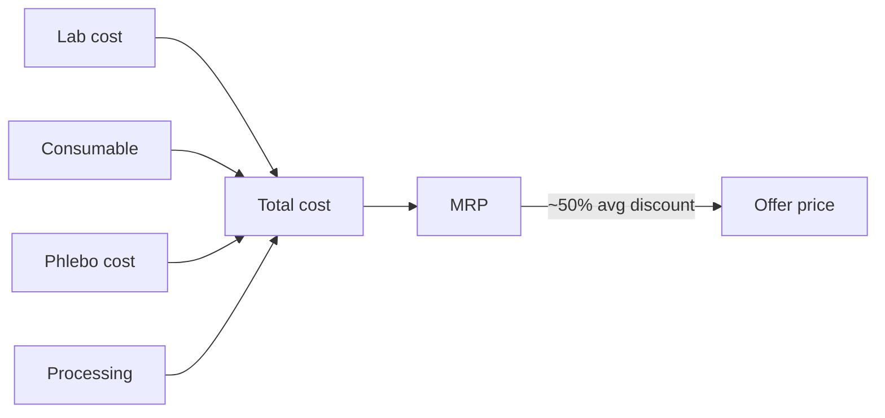
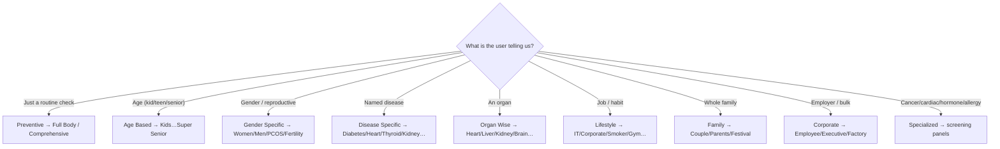
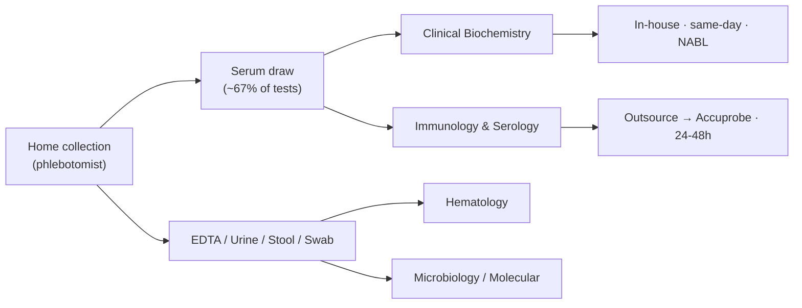

# Biocity — Blood Test Packages & Catalog Knowledge Bank

> **Domain knowledge bank** for the Biocity diagnostics catalog: every health
> **package**, every **test** in the master menu, and the category-wise structure
> that powers the website's package recommender, comparison and booking flows.
> Built to be *integrated* — the machine-readable twin lives at
> [`v3/assets/data/catalog.json`](../v3/assets/data/catalog.json).

- **Last updated:** 2026-08-17
- **Source of truth:** `Blood_Test_Packages_Completed.xlsx` → `catalog.json`
- **Regenerate:** `python3 docs/gen_catalog_kb.py` (never hand-edit the tables)

---

## 1. TL;DR — the catalog at a glance

- **85 packages** organised into **9 categories** (sections), priced **₹349–₹4,985** (median ₹1,059).
- **489 individual tests** in the master menu across **13 lab departments**.
- Fulfilment split: **147 in-house** vs **342 outsourced** (vendor *Accuprobe*); **27 tests carry NABL scope**.
- Per-test economics: MRP median **₹950**, offer median **₹480**, mean discount **50%**.
- Packages are assembled from **88 reusable panel building-blocks** (CBC, Lipid, KFT, LFT, Diabetes, Thyroid, Vitamin, Bone… reused across dozens of packages).

---

## 2. Two-sheet source model

The workbook has two sheets that join on **panel/test names**:

| Sheet | Rows | Grain | What it holds |
|---|---|---|---|
| `Package List` | 678 | section → package → component line | The **retail catalog**: 85 sellable packages grouped in 9 sections, each with an offer price and its constituent panels (+param counts). |
| `Test Details` | 490 | one test | The **operational master**: 489 tests with department, sample, fasting, TAT, processing/vendor, full cost stack, MRP/offer/discount, NABL scope, machine and profile mapping. |

### Test-master schema (22 columns)

`category` · `code` · `name` · `department` · `sample` · `fasting` · `special` (instruction) · `tat` · `processing` (In-house/Outsource) · `vendor` · **cost stack** (`lab_cost`, `consumable_cost`, `phlebo_cost`, `processing_cost`, `total_cost`) · `mrp` · `offer_price` · `discount` · `status` · `profile` (panel mapping) · `machine` · `nabl` (scope Y/N).

---

## 3. Package taxonomy — the 9 categories (mind map)



> The recommender maps a user's **age / gender / organ / disease / lifestyle** answer
> onto one of these branches. See [§9 Recommender map](#9-recommender-decision-map).

---

## 4. Full package directory (all 85, category-wise)

> Prices are the **offer price in ₹**. "Claimed tests" is the marketing count printed
> in the sheet; "key components" are the panel building-blocks (parameter count in brackets).

### SECTION 1 – Preventive Health Packages

*8 packages · ₹759–₹4,985*

| # | Package | Claimed | ₹ Offer | Key components (params) |
|---|---|---|---|---|
| 1 | **Full Body Checkup** | 85+ Test | 759 | Complete Blood Count (26), Liver Funtion Test (12), Kidney Function Test (9), Lipid Profile (8), Bone Profile (3), Diabeties Profile (2), … |
| 2 | **Comprehensive Health Checkup** | 90+ Test | 1459 | Complete Blood Count (26), Liver Funtion Test (12), Kidney Function Test (9), Lipid Profile (8), Bone Profile (3), Diabeties Profile (3), … |
| 3 | **Total Full Body Checkup** | 95+ Test | 2190 | Complete Blood Count (26), Liver Funtion Test (12), Kidney Function Test (9), Lipid Profile (8), Bone Profile (3), Diabeties Profile (3), … |
| 4 | **Advance Full Body Checkup** | 100+ Test | 2640 | Complete Blood Count (26), Liver Funtion Test (12), Kidney Function Test (9), Lipid Profile (8), Bone Profile (3), Diabeties Profile (3), … |
| 5 | **Platinum Package** | 110+ Test | 4985 | Blood Health & Anemia Screening (26), Fatty Liver & Liver Health Assessment (12), Kidney Health Screening (9), Advanced Heart Risk Screening (8), Bone Strength & Mineral Health Assessment (3), Diabetes Risk Assessment (3), … |
| 6 | **Annual Health Screening** | 99 Test | 2519 | Blood Health & Anemia Screening (26), Fatty Liver & Liver Health Assessment (12), Kidney Health Screening (9), Advanced Heart Risk Screening (8), Bone Strength & Mineral Health Assessment (3), Diabetes Risk Assessment (3), … |
| 7 | **Young Adult Wellness** | 87 Test | 1040 | Blood Health & Anemia Screening (26), Fatty Liver & Liver Health Assessment (12), Kidney Health Screening (9), Advanced Heart Risk Screening (8), Bone Strength & Mineral Health Assessment (3), Diabetes Risk Assessment (2), … |
| 8 | **Healthy Lifestyle Package** | 82 Test | 1339 | Complete Blood Count (26), Liver Function Test (12), Kidney Function Test (9), Lipid Profile (8), Diabetes Profile (3), Thyroid Screening (1), … |

### SECTION 2 – Gender Specific Packages

*14 packages · ₹439–₹2,789*

| # | Package | Claimed | ₹ Offer | Key components (params) |
|---|---|---|---|---|
| 9 | **Women's Wellness Basic** | 56 Test | 439 | Blood Health & Anemia Screening (26), Diabetes Risk Assessment (2), Hidden Iron Deficiency Detection (4), Thyroid Health Screening (3), Urinary Health Assessment (21) |
| 10 | **Women's Wellness Advanced** | 86 Test | 1729 | Blood Health & Anemia Screening (26), Fatty Liver & Liver Health Assessment (9), Kidney Health Screening (6), Advanced Heart Risk Screening (8), Bone Strength & Mineral Health Assessment (3), Diabetes Risk Assessment (2), … |
| 11 | **PCOS Screening** | 49 Test | 2789 | Blood Health & Anemia Screening (26), Diabetes Risk Assessment (5), Advanced Heart Risk Screening (8), Hormonal Health Assessment (4), DHEAS (1), E2 Female Reproductive Hormone Test (1), … |
| 12 | **PCOD PANEL** | 13 Test | 1589 | Hormonal Health Assessment (4), Thyroid Health Screening (3), Diabetes Risk Assessment (5), Testostrone Free (1) |
| 13 | **Fertility Profile** | 9 Test | 719 | Thyroid Health Screening (3), E2 Female Reproductive Hormone Test (1), Hormonal Health Assessment (4), Progestrone (1) |
| 14 | **Pregnancy Profile** | 78 Test | 2429 | Blood Health & Anemia Screening (26), Diabetes Risk Assessment (5), Blood Group (1), Thyroid Health Screening (2), Hidden Iron Deficiency Detection (5), Vitamin Deficiency Screening (2), … |
| 15 | **Menopause Health** | 43 Test | 1339 | Complete Blood Count (26), Lipid Profile (8), Bone Profile (3), Menopause Hormone Panel (4), Vitamin Profile (2) |
| 16 | **Breast Health Screening** | 31 Test | 1299 | Complete Blood Count (26), Breast Health Risk Panel (2), Thyroid Profile (3) |
| 17 | **Iron Deficiency Package** | 33 Test | 799 | Complete Blood Count (26), Iron Deficiency Profile (5), Vitamin B-Complex Assessment (2), Men |
| 18 | **Men's Wellness** | 81 Test | 1229 | Complete Blood Count (26), Liver Function Test (12), Kidney Function Test (9), Lipid Profile (8), Diabetes Profile (3), Thyroid Screening (1), … |
| 19 | **Executive Men's Health** | 91 Test | 2069 | Complete Blood Count (26), Liver Function Test (12), Kidney Function Test (9), Lipid Profile (8), Bone Profile (3), Diabetes Profile (3), … |
| 20 | **Testosterone Profile** | 5 Test | 749 | Testosterone Profile (2), Fertility Hormone Assessment (3) |
| 21 | **Prostate Screening** | 33 Test | 779 | Prostate Health Assessment (3), Kidney Function Test (9), Urine Routine & Microscopic Examination (21) |
| 22 | **Men's Fertility Profile** | 8 Test | 959 | Semen Analysis (1), Male Hormone Profile (4), Thyroid Profile (3) |

### SECTION 3 – Age Based Packages

*8 packages · ₹579–₹4,299*

| # | Package | Claimed | ₹ Offer | Key components (params) |
|---|---|---|---|---|
| 23 | **Kids Health** | 55 Test | 579 | Complete Blood Count (26), Iron Profile (4), Vitamin D - 25 Hydroxy (1), Urine Routine & Microscopic Examination (21), Stool Routine Examination (3) |
| 24 | **School Health** | 55 Test | 579 | Complete Blood Count (26), Iron Profile (4), Vitamin D - 25 Hydroxy (1), Urine Routine & Microscopic Examination (21), Stool Routine Examination (3) |
| 25 | **Teen Health** | 67 Test | 939 | Complete Blood Count (26), Liver Function Test (12), Thyroid Profile (3), Iron Profile (4), Vitamin D - 25 Hydroxy (1), Urine Routine & Microscopic Examination (21) |
| 26 | **College Student Health** | 81 Test | 1259 | Complete Blood Count (26), Liver Function Test (12), Kidney Function Test (9), Lipid Profile (8), Thyroid Profile (3), Vitamin Profile (2), … |
| 27 | **Working Professional** | 84 Test | 1439 | Complete Blood Count (26), Liver Function Test (12), Kidney Function Test (9), Lipid Profile (8), Diabetes Profile (3), Thyroid Profile (3), … |
| 28 | **Senior Citizen Basic** | 85 Test | 1179 | Complete Blood Count (26), Liver Function Test (12), Kidney Function Test (9), Lipid Profile (8), Bone Profile (3), Diabetes Profile (3), … |
| 29 | **Senior Citizen Advanced** | 98 Test | 2599 | Complete Blood Count (26), Liver Function Test (12), Kidney Function Test (9), Lipid Profile (8), Bone Profile (3), Diabetes Profile (3), … |
| 30 | **Super Senior Package** | 104 Test | 4299 | Complete Blood Count (26), Liver Function Test (12), Kidney Function Test (9), Lipid Profile (8), Bone Profile (3), Diabetes Profile (3), … |

### SECTION 4 – Disease Specific Packages

*16 packages · ₹539–₹1,979*

| # | Package | Claimed | ₹ Offer | Key components (params) |
|---|---|---|---|---|
| 31 | **Diabetes Care** | 44 Test | 1299 | Diabetes Profile (3), Insulin Resistance Assessment (2), Lipid Profile (8), Kidney Function Test (9), Urine Routine & Microscopic Examination (21), C-Peptide - Fasting (1) |
| 32 | **Pre-Diabetes Screening** | 13 Test | 759 | Diabetes Profile (3), Insulin Resistance Assessment (2), Lipid Profile (8) |
| 33 | **Hypertension Package** | 67 Test | 659 | Kidney Function Test (9), Electrolyte Panel (3), Lipid Profile (8), Complete Blood Count (26), Urine Routine & Microscopic Examination (21) |
| 34 | **Heart Health** | 26 Test | 1979 | Lipid Profile (8), Cardiac Risk Assessment (3), Advanced Cardiac Risk Markers (3), Kidney Function Test (9), Diabetes Profile (3) |
| 35 | **Stroke Risk Profile** | 23 Test | 1169 | Lipid Profile (8), Coagulation Profile (2), Homocysteine - Serum (1), Kidney Function Test (9), Diabetes Profile (3) |
| 36 | **Kidney Care** | 61 Test | 739 | Kidney Function Test (9), Electrolyte Panel (3), Advanced Renal Function (2), Urine Routine & Microscopic Examination (21), Complete Blood Count (26) |
| 37 | **Liver Care** | 61 Test | 659 | Liver Function Test (12), Advanced Liver Assessment (2), Complete Blood Count (26), Urine Routine & Microscopic Examination (21) |
| 38 | **Fatty Liver Package** | 49 Test | 639 | Liver Function Test (12), Lipid Profile (8), Diabetes Profile (3), Complete Blood Count (26) |
| 39 | **Thyroid Care** | 7 Test | 859 | Thyroid Profile (3), Free Thyroid Profile (3), Thyroid Autoimmunity (1) |
| 40 | **Arthritis Profile** | 38 Test | 1059 | Arthritis & Autoimmune Profile (3), Complete Blood Count (26), Kidney Function Test (9) |
| 41 | **Bone Health** | 31 Test | 539 | Bone Profile (3), Vitamin Profile (2), Complete Blood Count (26) |
| 42 | **Osteoporosis Screening** | 9 Test | 1059 | Bone Profile (3), Vitamin Profile (2), Menopause Hormone Panel (4) |
| 43 | **Vitamin Deficiency** | 4 Test | 739 | Vitamin Profile (2), Vitamin B-Complex Assessment (2) |
| 44 | **Anemia Profile** | 35 Test | 1059 | Complete Blood Count (26), Iron Deficiency Profile (5), Anemia Evaluation (2), Vitamin B-Complex Assessment (2) |
| 45 | **Fever Panel** | 33 Test | 989 | Complete Blood Count (26), Fever Infection Panel (5), Inflammatory Markers (2) |
| 46 | **Infection Profile** | 34 Test | 1099 | Complete Blood Count (26), Infection Screening (2), Sexual Health / Infection Screening (4), Inflammatory Markers (2) |

### SECTION 5 – Organ Wise Packages

*10 packages · ₹349–₹1,179*

| # | Package | Claimed | ₹ Offer | Key components (params) |
|---|---|---|---|---|
| 47 | **Heart** | 46 Test | 759 | Lipid Profile (8), Cardiac Risk Assessment (3), Kidney Function Test (9), Complete Blood Count (26) |
| 48 | **Liver** | 61 Test | 659 | Liver Function Test (12), Advanced Liver Assessment (2), Complete Blood Count (26), Urine Routine & Microscopic Examination (21) |
| 49 | **Kidney** | 35 Test | 629 | Kidney Function Test (9), Electrolyte Panel (3), Advanced Renal Function (2), Urine Routine & Microscopic Examination (21) |
| 50 | **Lung** | 30 Test | 439 | Respiratory Health Panel (4), Complete Blood Count (26) |
| 51 | **Brain** | 14 Test | 1179 | Lipid Profile (8), Homocysteine - Serum (1), Vitamin B-Complex Assessment (2), Diabetes Profile (3) |
| 52 | **Stomach** | 32 Test | 719 | Gastro-Intestinal Panel (3), Stool Routine Examination (3), Complete Blood Count (26) |
| 53 | **Pancreas** | 13 Test | 639 | Pancreatic Health Assessment (2), Diabetes Profile (3), Lipid Profile (8) |
| 54 | **Gall Bladder** | 29 Test | 519 | Gall Bladder & Pancreas Panel (3), Complete Blood Count (26) |
| 55 | **Eye Health** | 11 Test | 349 | Diabetes Profile (3), Lipid Profile (8) |
| 56 | **Bone & Joint** | 7 Test | 659 | Bone Profile (3), Arthritis & Inflammation Profile (2), Vitamin Profile (2) |

### SECTION 6 – Lifestyle Packages

*10 packages · ₹479–₹1,579*

| # | Package | Claimed | ₹ Offer | Key components (params) |
|---|---|---|---|---|
| 57 | **IT Professional** | 84 Test | 1439 | Complete Blood Count (26), Liver Function Test (12), Kidney Function Test (9), Lipid Profile (8), Diabetes Profile (3), Thyroid Profile (3), … |
| 58 | **Corporate Employee** | 82 Test | 1099 | Complete Blood Count (26), Liver Function Test (12), Kidney Function Test (9), Lipid Profile (8), Diabetes Profile (3), Thyroid Profile (3), … |
| 59 | **Night Shift Employee** | 54 Test | 1199 | Complete Blood Count (26), Liver Function Test (12), Lipid Profile (8), Diabetes Profile (3), Thyroid Profile (3), Vitamin Profile (2) |
| 60 | **Gym Goers** | 62 Test | 1579 | Complete Blood Count (26), Liver Function Test (12), Kidney Function Test (9), Lipid Profile (8), Vitamin Profile (2), Electrolyte Panel (3), … |
| 61 | **Weight Loss** | 54 Test | 1279 | Complete Blood Count (26), Liver Function Test (12), Lipid Profile (8), Thyroid Profile (3), Insulin Resistance Assessment (2), Diabetes Profile (3) |
| 62 | **Obesity** | 75 Test | 1319 | Complete Blood Count (26), Liver Function Test (12), Lipid Profile (8), Thyroid Profile (3), Insulin Resistance Assessment (2), Diabetes Profile (3), … |
| 63 | **Stress & Fatigue** | 30 Test | 759 | Complete Blood Count (26), Cortisol - Morning (1), Thyroid Screening (1), Vitamin Profile (2) |
| 64 | **Smokers** | 51 Test | 929 | Complete Blood Count (26), Lipid Profile (8), Liver Function Test (12), Inflammatory Markers (2), Cardiac Risk Assessment (3) |
| 65 | **Alcohol Users** | 40 Test | 479 | Liver Function Test (12), Complete Blood Count (26), Coagulation Profile (2) |
| 66 | **Sleep Health** | 13 Test | 689 | Thyroid Screening (1), Diabetes Profile (3), Lipid Profile (8), Vitamin D - 25 Hydroxy (1) |

### SECTION 7 – Family Packages

*5 packages · ₹779–₹1,959*

| # | Package | Claimed | ₹ Offer | Key components (params) |
|---|---|---|---|---|
| 67 | **Couple Checkup** | 86 Test | 1599 | Complete Blood Count (26), Liver Function Test (12), Kidney Function Test (9), Lipid Profile (8), Diabetes Profile (3), Thyroid Profile (3), … |
| 68 | **Newly Married** | 41 Test | 1959 | Complete Blood Count (26), Thyroid Profile (3), Sexual Health / Infection Screening (4), Male Hormone Profile (4), Female Hormone Profile (4) |
| 69 | **Family Package** | 82 Test | 1099 | Complete Blood Count (26), Liver Function Test (12), Kidney Function Test (9), Lipid Profile (8), Diabetes Profile (3), Thyroid Profile (3), … |
| 70 | **Parents Package** | 88 Test | 1769 | Complete Blood Count (26), Liver Function Test (12), Kidney Function Test (9), Lipid Profile (8), Bone Profile (3), Diabetes Profile (3), … |
| 71 | **Festival Package** | 78 Test | 779 | Complete Blood Count (26), Liver Function Test (12), Kidney Function Test (9), Lipid Profile (8), Diabetes Profile (2), Urine Routine & Microscopic Examination (21) |

### SECTION 8 – Corporate Packages

*6 packages · ₹579–₹2,069*

| # | Package | Claimed | ₹ Offer | Key components (params) |
|---|---|---|---|---|
| 72 | **Employee Wellness** | 79 Test | 879 | Complete Blood Count (26), Liver Function Test (12), Kidney Function Test (9), Lipid Profile (8), Diabetes Profile (3), Urine Routine & Microscopic Examination (21) |
| 73 | **Executive Health** | 91 Test | 2069 | Complete Blood Count (26), Liver Function Test (12), Kidney Function Test (9), Lipid Profile (8), Bone Profile (3), Diabetes Profile (3), … |
| 74 | **Factory Workers** | 71 Test | 579 | Complete Blood Count (26), Liver Function Test (12), Kidney Function Test (9), Urine Routine & Microscopic Examination (21), Stool Routine Examination (3) |
| 75 | **Office Staff** | 79 Test | 879 | Complete Blood Count (26), Liver Function Test (12), Kidney Function Test (9), Lipid Profile (8), Diabetes Profile (3), Urine Routine & Microscopic Examination (21) |
| 76 | **Driver Health** | 82 Test | 1039 | Complete Blood Count (26), Liver Function Test (12), Kidney Function Test (9), Lipid Profile (8), Diabetes Profile (3), Electrolyte Panel (3), … |
| 77 | **Annual Corporate Screening** | 87 Test | 1529 | Complete Blood Count (26), Liver Function Test (12), Kidney Function Test (9), Lipid Profile (8), Bone Profile (3), Diabetes Profile (3), … |

### SECTION 9 – Specialized Packages

*8 packages · ₹929–₹3,839*

| # | Package | Claimed | ₹ Offer | Key components (params) |
|---|---|---|---|---|
| 78 | **Cancer Screening** | 32 Test | 2379 | Complete Blood Count (26), Cancer Risk Screening - Male (1), Cancer Risk Screening - Female (1), GI Cancer Markers (3), Breast Cancer Marker (1) |
| 79 | **Cardiac Risk** | 23 Test | 1799 | Lipid Profile (8), Cardiac Risk Assessment (3), Advanced Cardiac Risk Markers (3), Kidney Function Test (9) |
| 80 | **Allergy** | 2 Test | 3839 | Allergy Risk Screening - Immunoglobulin E (1), Comprehensive Allergy Profile (1) |
| 81 | **Food Intolerance** | 1 Test | 3569 | Comprehensive Allergy Profile (1) |
| 82 | **Autoimmune Screening** | 30 Test | 1779 | Autoimmune Screen (3), Complete Blood Count (26), Thyroid Autoimmunity (1) |
| 83 | **Hormone Profile** | 12 Test | 1559 | Thyroid Profile (3), Male Hormone Profile (4), Female Hormone Profile (4), Cortisol - Morning (1) |
| 84 | **Hair Fall Profile** | 5 Test | 929 | Hair Fall Assessment (5) |
| 85 | **Skin Health** | 32 Test | 929 | Complete Blood Count (26), Vitamin Profile (2), Zinc - Serum (1), Thyroid Profile (3) |

---

## 5. Reusable panel building-blocks (mind map)

Packages are not bespoke — they are **compositions of a small set of core panels**.
These are the most-reused components across all 85 packages:



| Panel building-block | Reused in # packages | Typical params |
|---|---|---|
| Complete Blood Count | 55 | 26 |
| Lipid Profile | 41 | 8 |
| Kidney Function Test | 35 | 9 |
| Urine Routine & Microscopic Examination | 31 | 21 |
| Liver Function Test | 30 | 12 |
| Diabetes Profile | 30 | 3 |
| Thyroid Profile | 26 | 3 |
| Vitamin Profile | 22 | 2 |
| Bone Profile | 15 | 3 |
| Cardiac Risk Assessment | 9 | 3 |
| Diabetes Risk Assessment | 8 | 5 |
| Thyroid Health Screening | 8 | 2 |
| Iron Profile | 7 | 4 |
| Blood Health & Anemia Screening | 7 | 26 |
| Cancer Risk Screening - Male | 7 | 1 |
| Hidden Iron Deficiency Detection | 6 | 5 |
| Urinary Health Assessment | 6 | 21 |
| Electrolyte Panel | 6 | 3 |
| Fatty Liver & Liver Health Assessment | 5 | 5 |
| Kidney Health Screening | 5 | 6 |

> **101 distinct** component lines exist in total; the tail is package-specific add-ons (cancer markers, hormones, allergy panels, etc.).

---

## 6. Test master — category-wise breakdowns

### By lab department

Where the test is physically run. Biochemistry + Immunology dominate the menu.

| Value | Count |
|---|---|
| Clinical Biochemistry | 263 |
| Immunology and Serology | 137 |
| Hematology | 28 |
| Clinical Microbiology | 18 |
| Molecular Biology | 18 |
| Clinical Pathology | 10 |
| Cytology | 4 |
| Allergy | 2 |
| Flow Cytometry | 2 |
| Histopathology | 2 |
| Chromatography | 2 |
| Cytogenetics | 2 |
| Endocrinology | 1 |

### By processing & vendor

*In-house* = run at Biocity's own lab; *Outsource* = sent to partner **Accuprobe**. In-house tests are the fast, same-day, NABL-scoped core.

| Value | Count |
|---|---|
| Outsource | 342 |
| In-house | 147 |

### By turnaround time (TAT)

| Value | Count |
|---|---|
| 24-48 hrs | 304 |
| Same day (6-8 hrs) | 146 |
| 48-72 hrs | 31 |
| 2-4 days | 4 |
| 3-5 days | 2 |
| 7-10 days | 2 |

### By NABL scope

NABL-accredited scope tests are the marketable trust signal — all are in-house, same-day.

| Value | Count |
|---|---|
| No | 462 |
| Yes | 27 |

### By fasting requirement

| Value | Count |
|---|---|
| No | 452 |
| Yes | 37 |

### By machine / technology

| Value | Count |
|---|---|
| Fully Automated Biochemistry Analyzer | 263 |
| CLIA Immunoassay Analyzer | 140 |
| 5-Part Automated Hematology Analyzer | 28 |
| Automated Culture System (BacT/ALERT) & Manual Culture | 18 |
| Real-Time PCR System | 18 |
| Manual Microscopy | 10 |
| Manual Microscopy (Cytology) | 4 |
| Flow Cytometer | 2 |
| Manual Microscopy (Histopathology) / Tissue Processor | 2 |
| HPLC / Atomic Absorption Spectrophotometer | 2 |
| Fluorescence Microscope (FISH) / Karyotyping System | 2 |

### Top sample types

| Sample | Count |
|---|---|
| Serum (1ml) | 328 |
| WB-EDTA (3 ml) | 38 |
| Urine (25ml) | 20 |
| Urine (5 ml) | 10 |
| Urine (25 ml) | 5 |
| Stool (1 g) | 4 |
| Na Citrate - Plasma (3 ml) | 3 |
| Sputum (3-5 ml) | 3 |
| EDTA Plasma (3 ml) | 3 |
| Urine (10 mL) | 3 |
| Plasma - NaF (1ml) | 3 |
| Serum (4ml) | 2 |
| Urine | 2 |
| WB-K2 EDTA (2-3 mL) | 2 |
| Pus or Pus Swab (1-2 Nos.) in Sterile screw capped container. | 2 |
| Tissue in 10% Formalin | 2 |
| WB-Na. Heparin (3ml) | 2 |
| Na Citrated Plasma (1ml) | 2 |
| Semen (1 ml) | 2 |
| Plasma-EDTA (2ml) | 1 |

> **Serum (1 ml)** is the workhorse specimen (~67% of the menu); a single serum draw
> unlocks most biochemistry + immunology tests — key for the home-collection model.

---

## 7. Profile / panel mapping catalog

`profile` groups raw tests into the named panels used in packages & reports:

| Profile / panel | # member tests |
|---|---|
| Liver Function Test | 45 |
| Hepatitis Panel | 17 |
| Diabetes Profile | 16 |
| Complete Blood Count | 15 |
| STD / Infection Screening Profile | 13 |
| Kidney Function Test with Electrolyte | 12 |
| Lipid Profile | 11 |
| Electrolyte Panel (Na/K/Cl) | 10 |
| Stool Examination Profile | 8 |
| Bone / Vitamin D Profile | 7 |
| Thyroid Profile | 7 |
| Dengue Profile | 7 |
| Allergy Profile | 6 |
| Arthritis & Inflammation Profile | 5 |
| Iron Profile | 5 |
| Fertility / Hormone Profile | 4 |
| Vitamin B-Complex Profile | 4 |
| TORCH Panel | 4 |
| Tumor Marker Profile | 3 |
| Male / Female Hormone Profile | 3 |
| Pancreatic Profile | 2 |
| Autoimmune Profile | 2 |
| Malaria Profile | 2 |
| Prostate / Cancer Marker Profile | 2 |
| Widal / Typhoid Profile | 2 |
| Cancer Marker Profile - Female | 1 |
| Urine Routine Examination | 1 |
| Coagulation Profile | 1 |

---

## 8. Pricing & unit economics



- **Per-test:** MRP ₹70–₹27,555 (median ₹950); offer ₹40–₹12,500 (median ₹480); discount mean **50%** (max 75%).
- **Cost stack** per test = `lab_cost + consumable_cost + phlebo_cost + processing_cost = total_cost`. The phlebo (home-collection) cost is a flat loading on every test — amortised across a package it's negligible, which is *why packages are the profitable unit*, not single tests.
- **Package pricing** ladder (offer ₹): ₹349 (cheapest, *Eye Health*) → ₹4,985 (*Platinum*).

---

## 9. Recommender decision map

How a website visitor's inputs should resolve to a package category:



**Integration signals available in `catalog.json`** for ranking within a branch:
`offer_price` (budget), component `params` (comprehensiveness), `claimed_tests`, and the
panel building-blocks (match user concern → package that contains that panel).

---

## 10. Sample → department → fulfilment flow



---

## 11. Data-quality caveats (read before integrating)

- **Claimed vs actual counts:** the "85+ Test" style label is a *marketing* count and
  doesn't always equal the sum of component params — display the label, but rank on real params.
- **Spelling in source:** component names contain typos (e.g. *"Funtion"*, *"Diabeties"*,
  *"Testostrone"*). Keep a normalisation map before showing on the site.
- **One `Inactive` test** exists in the master (488 Active / 1 Inactive) — filter on `status`.
- **Discount anomaly:** discount ranges from **-24%** (a few tests priced *above* MRP) to 75%.
  Clamp/validate before rendering a "% off" badge.
- **Profile mapping is sparse:** 274/489 tests have no `profile` — treat blank as "standalone test".

---

## 12. Integration guide (site ↔ data)

| Site surface | Data to use |
|---|---|
| Packages grid / comparison | `sections[].packages[]` → name, `offer_price`, `claimed_tests`, `components[]` |
| Recommender (age/disease/organ) | section branch (§9) + filter packages by component panel |
| Individual test pages / search | `tests[]` → `name`, `department`, `sample`, `fasting`, `tat`, `mrp`, `offer_price` |
| Trust badges | `nabl == "Yes"`, `processing == "In-house"`, same-day `tat` |
| "% off" badges | `discount` (validate 0–0.75) |

Load once, cache client-side:

```js
const cat = await fetch('assets/data/catalog.json').then(r => r.json());
// cat.sections[].packages[] , cat.tests[] , cat.analytics
```

---

## 13. Maintenance protocol

1. Update `Blood_Test_Packages_Completed.xlsx` → re-export → overwrite `v3/assets/data/catalog.json`.
2. Run `python3 docs/gen_catalog_kb.py` to regenerate this file.
3. Commit the xlsx-derived JSON **and** this doc in the same commit.
